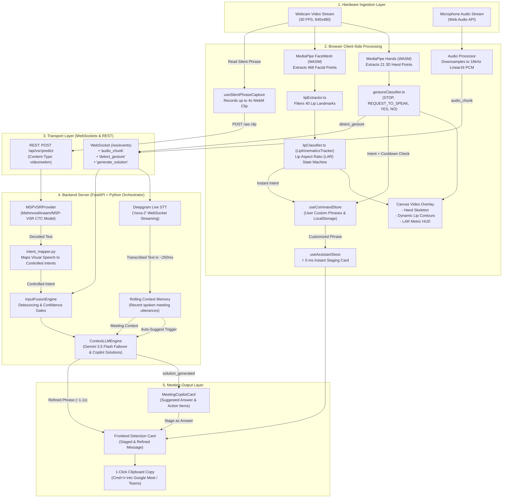

# 🎙️ Silent Meeting Assistant (AI-Powered Multimodal Meeting Companion)

[](https://fastapi.tiangolo.com/)
[](https://reactjs.org/)
[](https://developers.google.com/mediapipe)
[](https://huggingface.co/MahmoodAnaam/MSP-VSR)
[](https://deepgram.com/)
[](https://ai.google.dev/)
[-brightgreen)]()

> **Target Problem Statement (🔴 HARD — Silent Meeting Assistant):**  
> *In some situations, people may not be able to speak aloud during a meeting or may prefer to communicate silently. Build an AI-powered silent communication system that uses a webcam to interpret specific facial or hand movements and converts them into text in real time with command customization.*

Silent Meeting Assistant is an ultra-low-latency, privacy-first companion application designed to run alongside active video conferences (Google Meet, Zoom, Microsoft Teams). It enables users to silently participate in meetings using hands-free physical gestures, geometric lip kinematics, deep-learning Visual Speech Recognition (VSR), live background meeting transcription, and an automated AI Meeting Copilot.

---

## 🚀 Key Architectural Highlights

- **🔒 Local-First Privacy (0 ms Video Latency):** Video frames from your webcam **never leave your computer**. MediaPipe Hands and MediaPipe FaceMesh execute completely in-browser via WebAssembly (WASM) at 30 FPS.
- **⚡ Two-Phase Staging Architecture:**
  - **Phase 1 (0 ms Instant Staging):** Recognized gestures and lip motions instantly stage pre-configured or customized text locally in the browser with zero perceptible delay.
  - **Phase 2 (~1.1 s Contextual Expansion):** In the background, Google Gemini (via multi-model failover) merges the intent with the active meeting discussion to generate natural, conversation-aware phrasing.
- **👄 Dual-Path Lip Communication:**
  - **Path A: Instant Geometric Lip Kinematics (0 ms):** Evaluates instantaneous **Lip Aspect Ratio (LAR)** across 40 canonical FaceMesh landmarks, classifying controlled silent articulations (`QUESTION`, `STOP`, `AGREE`) with dynamic canvas HUD feedback.
  - **Path B: Pretrained Visual Speech Recognition (VSR):** Integrates Hugging Face's [`MahmoodAnaam/MSP-VSR`](https://huggingface.co/MahmoodAnaam/MSP-VSR) CTC deep learning model to read multi-word silent phrases from short camera clips and map them into controlled meeting commands.
- **🎙️ Live Deepgram STT Streaming Pipeline:** Streams 16 kHz linear PCM audio buffers directly to Deepgram's `nova-2` model via WebSocket, maintaining a continuous rolling memory of the meeting's live context.
- **💡 AI Meeting Copilot (Answer & Solution Generator):** Automatically synthesizes recommended answers and structured bullet-point solutions based on speech heard in the meeting, ready to stage or copy with 1 click.
- **⚙️ User Command Customization:** Includes a built-in Command Settings Manager to customize phrase templates for any gesture or lip command, add custom commands, and persist configurations across sessions.

---

## 📐 Complete End-to-End System Flow



---

## 🛠️ Subsystems & Pipelines

### 1. Pretrained Visual Speech Recognition (VSR / Lip-Reading)
In addition to instant geometric lip kinematics, the assistant incorporates a **deep-learning Visual Speech Recognition (VSR)** pipeline based on [`MahmoodAnaam/MSP-VSR`](https://huggingface.co/MahmoodAnaam/MSP-VSR):
- **Model Architecture:** CTC-based visual speech recognition model trained on lip-reading datasets (such as LRW).
- **How It Works:**
  1. The user clicks **"Read silent phrase"** in `<CameraFeed />`.
  2. The `useSilentPhraseCapture` hook taps into the active camera stream (without opening a second camera instance) and captures up to a 4-second WebM video clip.
  3. The clip is sent to the local endpoint `POST /api/vsr/predict`.
  4. Backend `MSPVSRProvider` decodes video frames, runs PyTorch CTC inference, and calculates token confidence via mean maximum softmax probabilities.
  5. `backend/vsr/intent_mapper.py` deterministically maps recognized visual speech to controlled meeting intents:
     - *"can you repeat that please"* $\to$ `PLEASE_REPEAT`
     - *"yes, I agree"* $\to$ `YES`
     - *"I have a question about this"* $\to$ `QUESTION`
     - *"please stop here"* $\to$ `STOP`
     - *"thank you"* $\to$ `THANK_YOU`
     - *"let me speak"* $\to$ `REQUEST_TO_SPEAK`
  6. Unknown phrases safely map to `None` with `confidence = 0.0` to avoid accidental or hallucinated commands.
  7. Recognized commands are staged with `metadata.recognized_text` preserved.
- **Privacy Guarantee:** All video decoding and inference happen **100% locally**. Video clips are stored only in an ephemeral temporary directory and are deleted immediately in `finally` blocks upon completion.

#### ❓ Why is VSR Disabled by Default?
`VSR_ENABLED=false` is set by default for several practical reasons:
1. **Lightweight Startup:** Running `MahmoodAnaam/MSP-VSR` requires downloading model weights from Hugging Face (~hundreds of megabytes) and loads PyTorch, Transformers, and PyAV into memory.
2. **Latency Trade-Off:** The default geometric LAR classifier runs in-browser at 30 FPS with **0 ms latency** (sub-250 ms reaction), whereas deep video VSR is a clip-based multi-frame inference path taking ~2–4 seconds on CPU.
3. **Opt-In Deployment:** Users can run the entire app immediately in mock/dev mode without external dependencies. To enable VSR, simply set `VSR_ENABLED=true` in your `.env`.

---

### 2. Geometric Lip Articulation Kinematics (MediaPipe FaceMesh)
- Operates client-side in real time at 30 FPS with **0 ms latency**.
- Filters 40 inner and outer lip landmark indices (`LIP_INDICES`).
- Computes the normalized **Lip Aspect Ratio (LAR)**:
  $$\text{LAR} = \frac{\sqrt{(x_{14} - x_{13})^2 + (y_{14} - y_{13})^2}}{\sqrt{(x_{291} - x_{61})^2 + (y_{291} - y_{61})^2}}$$
- Temporal state machine (`LipKinematicsTracker`) evaluates a 24-frame rolling window (~800 ms):
  - **`QUESTION`**: Rapid transition from closed mouth ($\text{LAR} < 0.16$) to wide articulation ($\text{LAR} \ge 0.28$).
  - **`STOP`**: Sustained wide mouth opening ($\text{LAR} > 0.35$) for $\ge 12$ consecutive frames.
  - **`AGREE`**: Lips compressed/pursed ($\text{LAR} < 0.09$) for $\ge 8$ consecutive frames.
- Renders dynamic canvas visual feedback:
  - 🟢 **Emerald**: Neutral mouth at rest.
  - 🟡 **Glowing Amber**: Mouth opening / articulating.
  - 🔴 **Crimson Red**: Sustained wide opening (`STOP`).
  - 🔵 **Cyan**: Pursed lips (`AGREE`).

---

### 3. Physical Gesture Pipeline (MediaPipe Hands)
- 21 canonical 3D hand landmarks are processed at 30 FPS.
- Geometric relative finger-extension heuristics classify:
  - **Open Palm (5 fingers extended):** `STOP` (*"Please pause or stop here."*)
  - **Raised Hand (4 fingers up, thumb folded):** `REQUEST_TO_SPEAK` (*"I would like to speak."*)
  - **Thumbs Up (Thumb pointing up, 4 fingers folded):** `YES` (*"Yes, I agree."*)
  - **Thumbs Down (Thumb pointing down below wrist):** `NO` (*"No, I disagree."*)
- Enforces a 1,500 ms cooldown debounce filter to prevent repeated firings.

---

### 4. Live Audio Speech-to-Text (Deepgram STT)
- Captures microphone audio using the Web Audio API.
- Converts floating-point audio into **16 kHz, 16-bit mono linear PCM** buffers streamed every 256 ms over WebSockets.
- Includes a 60-chunk pre-buffering queue to ensure no spoken words are lost during WebSocket handshake.
- Displays a real-time RMS VU audio level bar in the UI.
- Backend streaming client connects to Deepgram's `nova-2` speech model, returning live finalized transcripts in **~250 ms**.
- Transcripts update a rolling context memory buffer used to inform AI generation.

---

### 5. AI Meeting Copilot (Answer & Solution Engine)
- Powered by Google Gemini with structured JSON output and multi-model failover (`gemini-3.5-flash-lite` $\to$ `gemini-3.5-flash` $\to$ `gemini-3.6-flash`).
- **On-Demand or Auto-Suggest:**
  - When enabled, automatically detects questions in meeting speech and synthesizes answers.
  - Users can also click **[✨ Suggest Answer]** on any transcript.
- Generates structured recommendations:
  - **Query:** The question or topic heard.
  - **Suggested Answer:** A professional 1–2 sentence verbal reply.
  - **Actionable Solution Points:** 2–3 concise takeaway bullet points.
  - **Category:** Topic classification badge.
- Interactive actions in `MeetingCopilotCard`:
  - **[Stage as Answer]:** Transfers the AI answer directly into the silent communication staging pipeline for 1-click confirmation.
  - **[Copy]:** Copies answer and solution points to the system clipboard.

---

### 6. Command Customization System
- Accessible via the **`[⚙️ Commands]`** button in the header.
- Users can edit any predefined phrase, add brand-new custom commands, or restore factory defaults.
- Saved automatically in `localStorage` and synced with backend REST endpoints (`POST /api/commands` and `POST /api/commands/reset`).

---

## 📋 Prerequisites & Installation

### Prerequisites
- **Python 3.11+** (Tested on Python 3.12)
- **Node.js 18+** (Tested on Node.js 20 & 26)
- **Google Chrome** (Recommended for WebRTC & WebAssembly SIMD support)
- API Keys:
  - [Google Gemini API Key](https://aistudio.google.com/) (`GEMINI_API_KEY`)
  - [Deepgram API Key](https://console.deepgram.com/) (`DEEPGRAM_API_KEY`)

### Setup Instructions

1. **Clone the repository:**
   ```bash
   git clone https://github.com/your-username/silent-meeting-assistant.git
   cd silent-meeting-assistant
   ```

2. **Configure Environment Variables:**
   Create a `.env` file in the root directory:
   ```env
   # API Keys
   GEMINI_API_KEY="your-gemini-api-key-here"
   DEEPGRAM_API_KEY="your-deepgram-api-key-here"

   # Operating Mode: "mock" | "production"
   DEV_MODE="production"

   # Visual Speech Recognition (VSR) Configuration (Optional)
   VSR_ENABLED=false
   VSR_MODEL_ID="MahmoodAnaam/MSP-VSR"
   VSR_MODEL_REVISION="main"
   VSR_DEVICE="cpu"
   VSR_MAX_CLIP_BYTES=8000000
   VSR_MIN_CONFIDENCE=0.80
   ```

3. **Install Backend Dependencies:**
   ```bash
   python3 -m venv .venv
   source .venv/bin/activate
   pip install -r requirements.txt

   # If enabling VSR:
   pip install transformers safetensors av
   ```

4. **Install Frontend Dependencies:**
   ```bash
   cd frontend
   npm install
   cd ..
   ```

---

## 🏃 How to Run the Application

### Option 1: Run Backend & Frontend Concurrently
In Terminal 1 (Backend):
```bash
source .venv/bin/activate
python scripts/dev.py
```
*Backend runs on `http://127.0.0.1:8000` with WebSocket endpoint at `ws://127.0.0.1:8000/ws/events`.*

In Terminal 2 (Frontend):
```bash
cd frontend
npm run dev
```
*Frontend opens on `http://localhost:5173`.*

---

## 💻 Meeting Companion Workflow (Google Meet / Zoom / Teams)

1. Open `http://localhost:5173` in Google Chrome and position the window next to your active Google Meet tab.
2. In the **Meeting Context Drawer**, toggle **"Live Mic"**:
   - The assistant streams mic audio to Deepgram and populates meeting context in real time with an active VU meter.
   - Toggle **"Auto-Suggest"** to automatically receive AI answer suggestions on questions heard in the meeting.
3. Click **"Turn on Live Camera"**:
   - The MediaPipe camera overlay starts tracking your hands and lip movements.
4. **Trigger Hands-Free Silent Commands:**
   - **Lip Question:** Open your mouth naturally to ask a question. The lip contour turns glowing amber, the HUD indicates `LAR: 0.35 | OPENING`, and `"I have a question regarding this."` is staged in **0 ms**.
   - **Hand Gestures:** Raise your hand (🙋), show a thumbs up (👍), or show an open palm (✋).
   - **Silent Phrase Lip-Reading (VSR):** Click **"Read silent phrase"**, mouth a short phrase (e.g. *"Can you repeat that please"*), and click stop. The VSR model reads the clip and stages the matching command.
5. In ~1 second, Gemini refines the staged message using the ongoing discussion context.
6. Click **[Send to Meeting]** (or press Enter) $\to$ The message is copied to your clipboard.
7. Switch to Google Meet and press `Cmd+V` (or `Ctrl+V`) to send the message into the chat silently.

---

## 🧪 Testing & Verification

The codebase includes a comprehensive automated test suite with **95 passing tests**:

```bash
# Run Backend Pytest Suite (58 tests)
PYTHONPATH=. .venv/bin/pytest tests/ -v

# Run Frontend Vitest Suite (37 tests)
cd frontend && npm test -- --run

# Verify Frontend Production Build & TypeScript Type Checking
cd frontend && npm run build
```

### Test Coverage Highlights:
- **`tests/test_vsr_provider.py` & `test_vsr_intent_mapper.py`**: Verifies VSR provider contract, lazy model loading, temporary file cleanup, and deterministic alias mapping.
- **`tests/test_vsr_e2e.py`**: Validates mock end-to-end VSR flow from video upload to intent mapping, orchestrator staging, and WebSocket dispatch.
- **`tests/test_api_server.py`**: Validates REST endpoints (`/api/commands`, `/api/vsr/predict`), WebSockets, solution generation, and auto-suggest toggles.
- **`tests/test_audio_stt.py`**: Tests Deepgram live streaming STT provider, pre-buffering queue, and chunk processing.
- **`tests/test_llm_engine.py`**: Tests Gemini solution synthesis, fallback generation, and context summarization.
- **`frontend/src/hooks/__tests__/useSilentPhraseCapture.test.ts`**: Tests MediaRecorder clip capture, browser WebM format selection, and local API request packaging.
- **`frontend/src/store/__tests__/useAssistantStore.test.ts`**: Verifies solution state lifecycle, staging AI solutions as answers, and command customizations.

---

## 📁 Repository Structure

```
slient-meeting-assitant/
├── backend/                        # Python FastAPI Backend
│   ├── api/
│   │   └── server.py               # REST, WebSocket & /api/vsr/predict Endpoints
│   ├── audio/
│   │   └── stt.py                  # Deepgram Live Streaming STT Provider & Pre-buffer
│   ├── llm/
│   │   └── engine.py               # Gemini Refinement & Copilot Solution Synthesis
│   ├── models/
│   │   ├── commands.py             # Command Registry & Dynamic Updates
│   │   ├── events.py               # Multimodal Communication Event Schemas
│   │   └── lip_model.py            # PyTorch Bidirectional GRU Lip Classifier
│   ├── vision/
│   │   ├── gesture.py              # Backend Geometric Gesture Classifier
│   │   └── lip_features.py         # 40-Point Lip Feature Vector Extraction
│   ├── vsr/                        # Pretrained Visual Speech Recognition (VSR)
│   │   ├── intent_mapper.py        # Maps Visual Speech Text to Controlled Commands
│   │   ├── msp_provider.py         # MahmoodAnaam/MSP-VSR CTC Model Provider
│   │   └── types.py                # VSRPrediction & VSRProvider Protocols
│   ├── fusion.py                   # Confidence Thresholds & Multi-Modality Debouncing
│   └── orchestrator.py             # Central Event Dispatcher & State Coordinator
├── frontend/                       # React 18 + Vite Frontend Companion App
│   ├── public/mediapipe/           # Bundled Local WASM Assets (Hands & FaceMesh)
│   ├── src/
│   │   ├── components/
│   │   │   ├── CameraFeed.tsx      # Video Stream, Canvas HUD & Silent Phrase Button
│   │   │   ├── CommandSettingsModal.tsx # Command Customization UI Modal
│   │   │   ├── ContextDrawer.tsx   # Transcript, VU Meter, Mic Stream & Auto-Suggest
│   │   │   ├── DetectionCard.tsx   # Staged Message, Refinement Shimmer & Copy
│   │   │   ├── Header.tsx          # App Header, Mode Toggles & Settings Trigger
│   │   │   ├── MeetingCopilotCard.tsx # AI Answer Suggestion & Solution Bullet Points
│   │   │   └── SimulationBar.tsx   # Live Modality Manual Testing Controls
│   │   ├── hooks/
│   │   │   ├── useAudioStreamer.ts # 16kHz Linear16 PCM Web Audio Hook & RMS Meter
│   │   │   ├── useSilentPhraseCapture.ts # Deliberate Video Clip Capture for VSR
│   │   │   └── useWebSocket.ts     # Persistent WebSocket Client Hook
│   │   ├── store/
│   │   │   ├── useAssistantStore.ts# Staged Message, Copilot Solution & History State
│   │   │   └── useCommandStore.ts  # Custom Commands & LocalStorage Persistence
│   │   └── utils/
│   │       ├── gestureClassifier.ts# In-Browser Hand Geometric Classifier
│   │       ├── lipClassifier.ts    # In-Browser Lip Kinematics (LAR State Machine)
│   │       └── lipExtractor.ts     # 40 Canonical Lip Point Isolator
│   └── vite.config.ts              # Vite Bundler & WebSocket Proxy Configuration
├── tests/                          # Automated Pytest Suite (58 tests)
│   ├── test_api_server.py
│   ├── test_vsr_provider.py
│   ├── test_vsr_intent_mapper.py
│   ├── test_vsr_e2e.py
│   └── ...
└── README.md                       # Comprehensive Documentation
```

---

## 📜 License

This project was built for the **AI Engineering Hackathon** under the **🔴 HARD — Silent Meeting Assistant** problem statement. Licensed under the MIT License.
